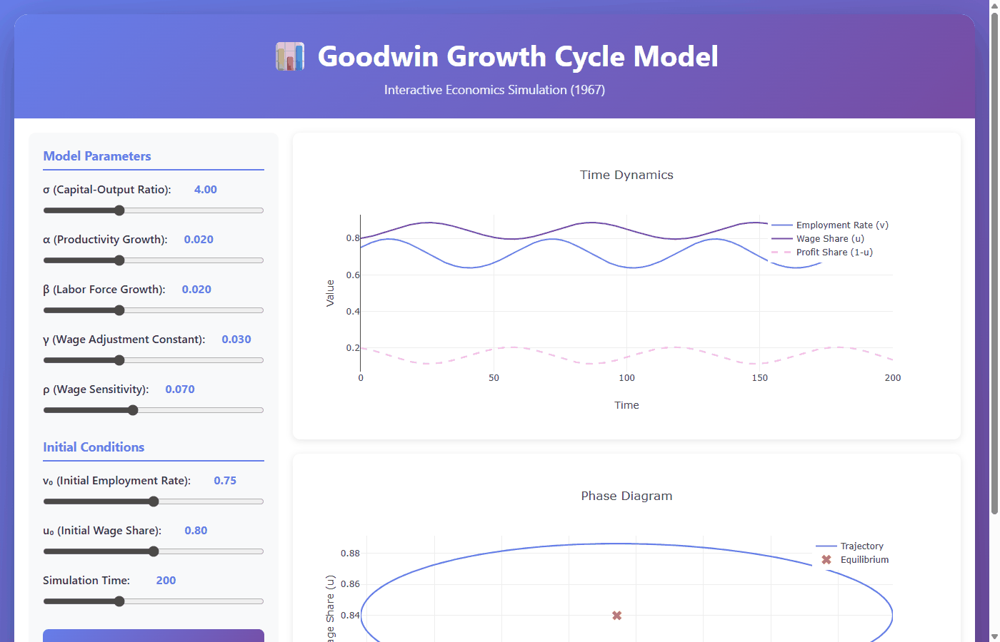

# Goodwin Growth Cycle Model (1967)

This repository provides a lightweight, interactive Julia implementation of Richard M. Goodwin’s “growth cycle” model (1967): 
a two-dimensional predator–prey dynamic system in which the employment rate (𝑣) and the wage-share (𝑢) orbit an interior steady state, 
generating endogenous cycles without exogenous shocks. The formulation adapts the Lotka–Volterra mechanics from biology
—originally developed by Lotka (1925) and Volterra (1928)—to macroeconomics, assuming that wage dynamics respond to labor-market tightness 
while capital accumulation and GDP growth are profit-led.


## App Features
- **Backend**: Julia HTTP server with JSON API
- **Frontend**: Static HTML with Plotly.js
- **Solver**: Custom Runge-Kutta 4th order integrator
- **Memory footprint**: ~50-100 MB (vs 500-700 MB with full stack)
- **Parameter adjustment:** Real-time through sliders
- **Plots:** Time series and phase diagram
- **Additional output:** Equilibrium point calculation for main endogenous variables

## 🌐 Online Demo

**Try it now:** [https://goodwin-growth-cycle.onrender.com](https://goodwin-growth-cycle.onrender.com)

> Note: First load may take 30-60 seconds as the free-tier server wakes up from sleep mode.

### App Preview



The animation shows:
1. **Initial state** - Default parameters loaded
2. **First simulation** - Running with default parameters (σ=4.0, α=β=0.02, γ=0.03, ρ=0.07)
3. **Parameter adjustment** - Changing σ to 4.5 and v₀ to 0.80 using interactive sliders
4. **Second simulation** - Observing how different parameters affect the cycle dynamics

## Model details

### Equations

The Goodwin model describes economic cycles through a predator-prey system:

```
dv/dt = v * [(1/σ - (α + β)) - u/σ]
du/dt = u * [ρ*v - (α + γ)]
```

Where:
- **v** = employment rate
- **u** = workers' share of output
- **σ** = capital-output ratio
- **α** = labor productivity growth rate
- **β** = labor force growth rate
- **γ** = constant in wage adjustment function
- **ρ** = sensitivity of wages to employment level

### Parameter ranges (you can modify them locally)

- **σ** (0.5-2.0): Capital-output ratio
- **α** (0.001-0.1): Labor productivity growth rate
- **β** (0.001-0.1): Labor force growth rate
- **γ** (0.001-0.1): Wage adjustment constant
- **ρ** (0.001-0.2): Wage sensitivity to employment


## Alternatives for running locally

### Option 1: Run with Julia (Direct)

**Prerequisites:**
- Install Julia 1.10 or newer from [julialang.org/downloads](https://julialang.org/downloads/)

**Steps:**

1. **Download the code** from GitHub (green "Code" button → Download ZIP, then extract)

2. **Open terminal/command prompt** and navigate to the project folder (where you unzip the repo):
   ```bash
   cd path/to/GoodwinApp
   ```
   Example (Windows): `cd C:\Users\YourName\Downloads\GoodwinApp`

   Example (Mac/Linux): `cd ~/Downloads/GoodwinApp`

3. **Install required Julia packages** (only needed first time):
   ```bash
   julia -e "using Pkg; Pkg.add([\"HTTP\", \"JSON3\"])"
   ```
   This will download and install the necessary packages (~2-3 minutes).

4. **Start the server**:
   ```bash
   julia server.jl
   ```
   You should see:
   ```
   🚀 Starting Goodwin Model Server...
   🌐 Server listening on: http://0.0.0.0:7860
   ✅ Access in browser: http://localhost:7860
   ```

5. **Open your browser** and go to:
   ```
   http://localhost:7860
   ```

   **Note:** The server binds to `0.0.0.0` but you must access it via `localhost` in your browser.

6. **Stop the server** when done: Press `Ctrl+C` in the terminal

---

### Option 2: Run with Docker (Containerized)

**Prerequisites:**
- Install Docker Desktop from [docker.com](https://www.docker.com/products/docker-desktop/)

**Steps:**

1. **Download the code** (same as Option 1)

2. **Open terminal/command prompt** and navigate to the project folder:
   ```bash
   cd path/to/GoodwinApp
   ```

3. **Build the Docker image** (only needed first time or after updates):
   ```bash
   docker build -t goodwin-app .
   ```
   This will take ~2-3 minutes to build.

4. **Run the container**:
   ```bash
   docker run -p 7860:7860 goodwin-app
   ```
   You should see the server starting message.

5. **Open your browser** and go to:
   ```
   http://localhost:7860
   ```

6. **Stop the container**: Press `Ctrl+C` in the terminal

**Troubleshooting:**
- If port 7860 is already in use, try: `docker run -p 8080:7860 goodwin-app` and open `http://localhost:8080`
- Make sure Docker Desktop is running before executing docker commands

## References

Goodwin, R. M. (1967). "A Growth Cycle". In C. H. Feinstein (Ed.), Socialism, Capitalism and Economic Growth. Cambridge University Press.

## License

MIT License

## Author

Demian Panigo (UNLP) - Educational use in macroeconomics courses
